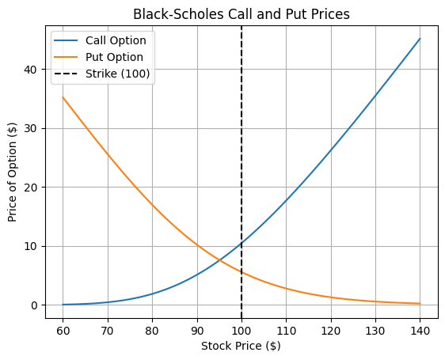
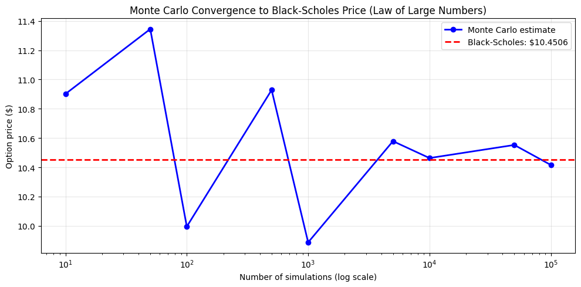
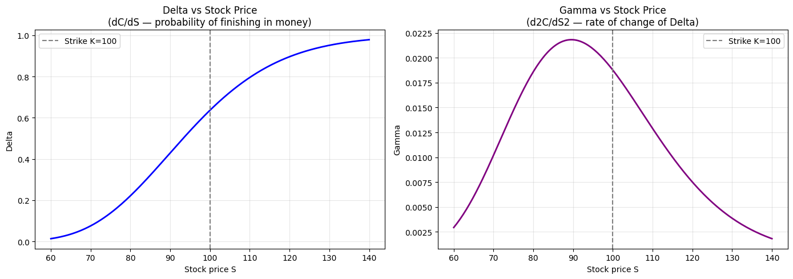
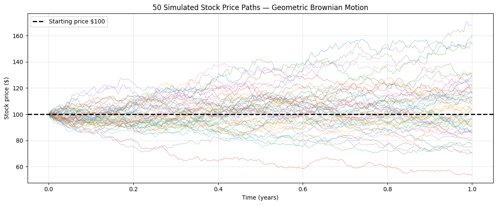
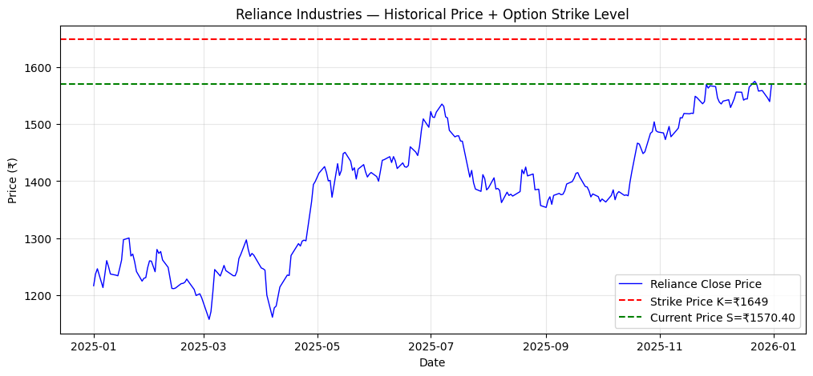

# Black-Scholes Option Pricing + Monte Carlo Risk Engine
## Overview

This project implements two mathematical approaches to European option pricing and financial risk modelling:

1. **Black-Scholes Analytical Pricer** — closed-form solution derived from a PDE using Ito's lemma
2. **Monte Carlo Simulation** — numerical method using Geometric Brownian Motion (100,000 paths)
3. **Greeks Calculator** — partial derivatives of the option price (Delta, Gamma, Theta, Vega)
4. **Real Market Validation** — applied to Reliance Industries (NSE) using RBI repo rate and historically computed volatility

---
## Tech Stack
```bash
Python 
NumPy        
SciPy        
Matplotlib  
yfinance     
```
## Mathematical Background

### Black-Scholes Formula

The price of a European call option is given by:

$$C = S \cdot N(d_1) - K \cdot e^{-rT} \cdot N(d_2)$$

$$d_1 = \frac{\ln(S/K) + (r + \sigma^2/2) \cdot T}{\sigma \sqrt{T}}, \quad d_2 = d_1 - \sigma\sqrt{T}$$

Where:
- $S$ = current stock price
- $K$ = strike price  
- $T$ = time to expiry (years)
- $r$ = risk-free rate (RBI repo rate = 5.25%)
- $\sigma$ = annualised volatility
- $N(\cdot)$ = cumulative standard normal distribution

### Geometric Brownian Motion (Monte Carlo)

Stock price at expiry is simulated as:

$$S_T = S_0 \cdot \exp\left[\left(r - \frac{\sigma^2}{2}\right)T + \sigma\sqrt{T} \cdot Z\right], \quad Z \sim \mathcal{N}(0,1)$$

Option price is the discounted expected payoff:

$$C \approx e^{-rT} \cdot \frac{1}{n} \sum_{i=1}^{n} \max(S_T^{(i)} - K,\ 0)$$

By the **Law of Large Numbers**, this converges to the true Black-Scholes price as $n \to \infty$.

### The Greeks

The Greeks are partial derivatives of the option price:

| Greek | Formula | Meaning |
|-------|---------|---------|
| Delta $\Delta$ | $\partial C / \partial S = N(d_1)$ | Price change per ₹1 move in stock |
| Gamma $\Gamma$ | $\partial^2 C / \partial S^2$ | Rate of change of Delta |
| Theta $\Theta$ | $\partial C / \partial t$ (per day) | Value lost per day (time decay) |
| Vega $\nu$ | $\partial C / \partial \sigma \times 0.01$ | Sensitivity to 1% volatility change |

---

## Results

### Call vs Put Prices


### Monte Carlo Convergence (Law of Large Numbers)


### Greeks — Delta and Gamma


### 50 Simulated GBM Stock Price Paths


### Real Market Data — Reliance Industries (NSE)


---

## Real Market Validation — Reliance Industries

| Parameter | Value |
|-----------|-------|
| Stock price (S) | ₹1,282.98 |
| Strike price (K) | ₹1,347.00 (5% OTM) |
| Time to expiry | 3 months (T = 0.25) |
| Risk-free rate | 5.25% (RBI repo rate) |
| Historical volatility | 17.42% (annualised) |
| **Call option price** | **₹27.25** |
| **Put option price** | **₹69.56** |

---

## Key Findings

- Monte Carlo (100,000 simulations) converges to within **₹0.005** of the Black-Scholes analytical price
- Delta = 0.37 for the Reliance OTM call — meaning a 37% probability of expiring in the money
- Theta = −0.31 per day — the option loses ₹0.31 of value daily purely from time decay
- Gamma peaks exactly at the strike price (ATM) — where Delta is changing fastest

---

## Limitations of Black-Scholes

1. **Constant volatility assumption** — real markets exhibit a "volatility smile" (implied vol varies with strike)
2. **Log-normal returns** — real returns have fat tails (more extreme events than the model predicts)
3. **No dividends** — the standard formula does not account for dividend payments
4. **Continuous trading** — assumes frictionless markets with no transaction costs

---

## How to Run

```bash
pip install numpy scipy matplotlib yfinance pandas
python project1_black_scholes_complete.py
```

Or open directly in Google Colab:

[](https://colab.research.google.com/github/DKB-004/black-scholes-monte-carlo/blob/main/black_scholes%2C_monte_carlo.ipynb)

---

## References

1. Black, F., Scholes, M. (1973). *The Pricing of Options and Corporate Liabilities*. Journal of Political Economy.
2. Hull, J. (2018). *Options, Futures, and Other Derivatives*. Pearson.
3. NSE India — Reliance Industries historical data via `yfinance`
4. Reserve Bank of India — repo rate (monetary policy)
